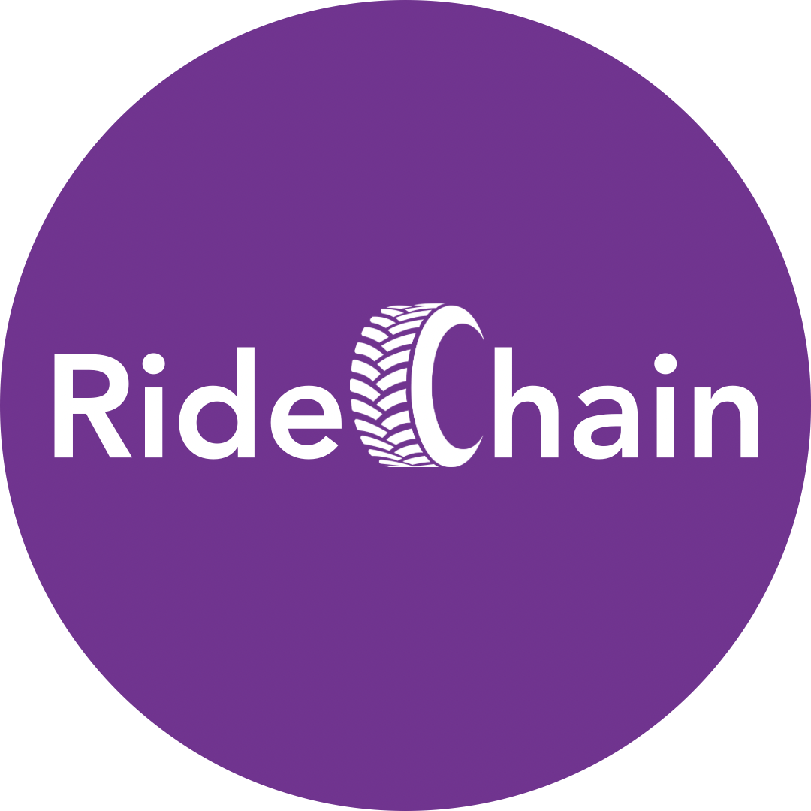

Ride Chain is a decentralised ride-sharing web application that uses blockchain technology to subtract the intermidiary fees in contemporary ride-hailing applications. It is built mainly on Next.js and will be deployed using Vercel.

## Features
- <b>Authentication:</b> Users must login using their MetaMask addres (TBC)
- <b>Location search:</b> Riders can search for their pick-up and drop-off point
- <b>Vehicle options:</b> Riders are able to select rides from 3 choices: Standard, XL, and Bike to meet their individual needs
- <b>Payment:</b> Payment is in Ethereum and directly deducted from one's MetaMask wallet (TBC)

Currently, not all features have been implemented, and the project is mainly focused on the frontend aspect.

## Deployment
To deploy the project locally, make sure to open the project folder and type 'vercel dev' in the terminal. Open [localhost://3000 ](http://localhost:3000) using your browser to see the project.

*Note: Project was done with reference to [this YouTube video](https://www.youtube.com/watch?v=w6N4JxqsOFA&t=258s). Additional Solidity smart contracts are in development and will be uploaded soon! :)